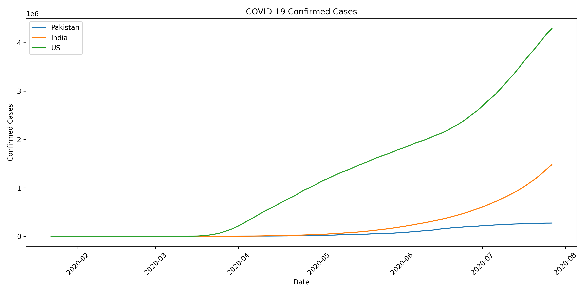
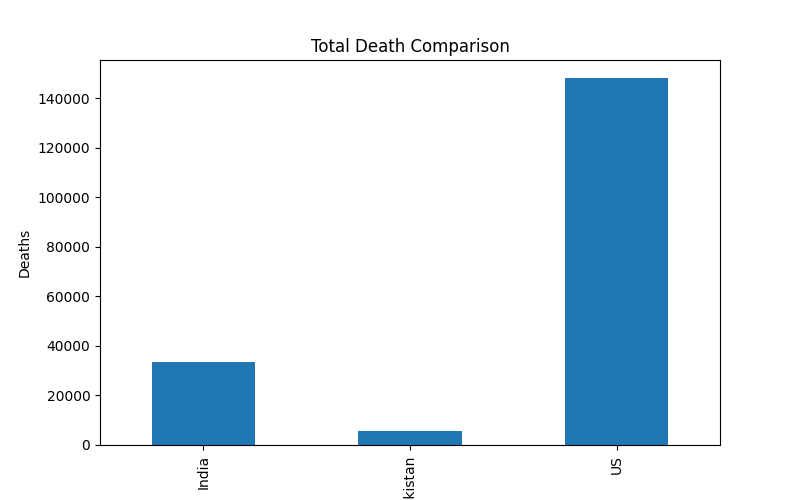
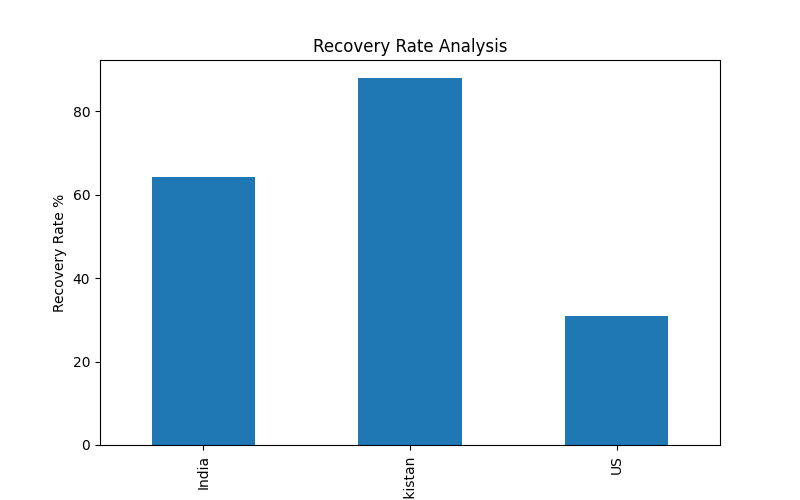
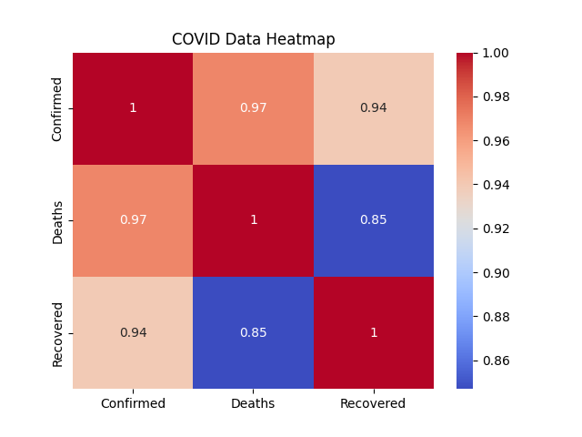

# 🦠 COVID-19 Data Visualizer & Analyzer

A Python-based data science project utilizing **Pandas**, **Matplotlib**, and **Seaborn** to filter, analyze, and visualize global COVID-19 trends, specifically comparing trajectories across Pakistan, India, and the US.

---

## 🚀 Features
* **📅 Datetime Parsing:** Dynamically cleans and handles sequential timeline trends.
* **📊 Comparative Analysis:** Tracks daily cumulative totals across multiple regions seamlessly.
* **📈 Metric Calculation:** Features custom recovery-rate calculation algorithms.
* **🔥 Correlation Heatmaps:** Displays relational data metrics using Seaborn heatmaps.

---

## 📊 Visualizations Generated

### 1. Daily Confirmed Cases Trend
Shows the growth trajectory and timeline of confirmed cases.


### 2. Total Death Volume Comparison
A stark comparative look at the absolute peak death toll numbers.


### 3. Recovery Rate Analysis
An analytical percentage-based breakdown of case resolution success.


### 4. Feature Correlation Matrix
A statistical heatmap evaluating how tightly case metrics are bound together.


---

## 🛠️ Tech Stack & Dependencies
* **Language:** Python 3.13+
* **Libraries:** `pandas`, `matplotlib`, `seaborn`
* **IDE:** PyCharm

---

## ⚙️ Setup Instructions

1. Clone the repository:
```bash
git clone [https://github.com/Asadlakhan-52/COVID19-Data-Visualizer.git](https://github.com/Asadlakhan-52/COVID19-Data-Visualizer.git)
cd COVID19-Data-Visualizer
